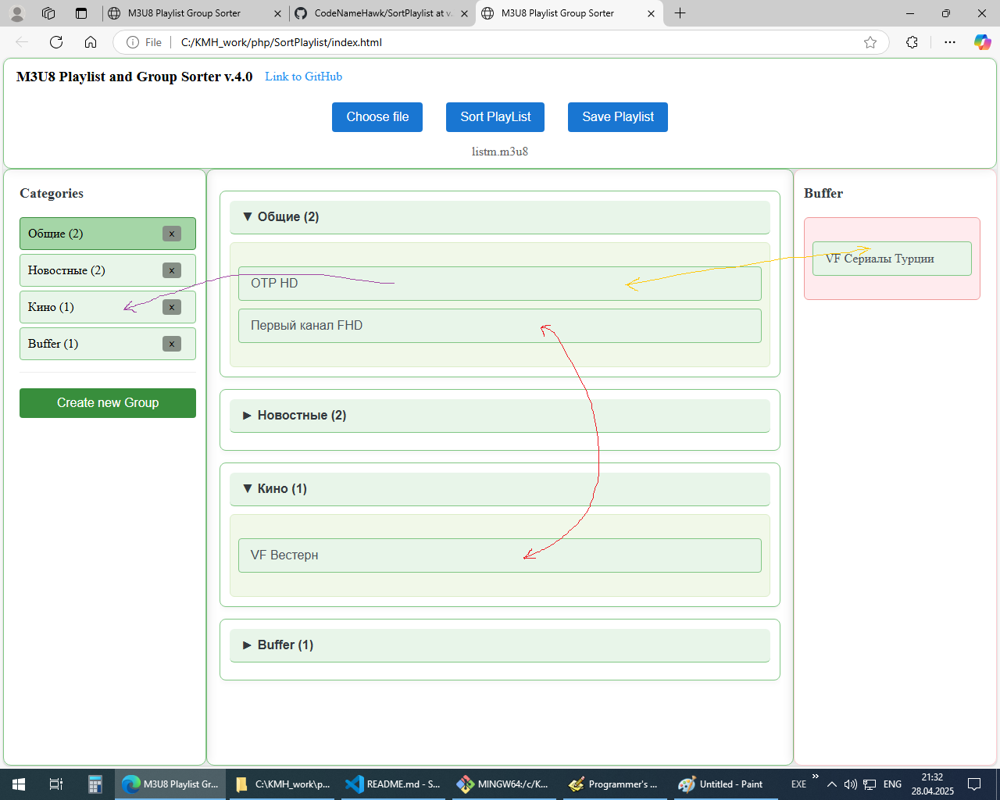

# Сортировщик групп M3U8 плейлиста  

## Описание  

Инструмент для сортировки и организации M3U8 плейлистов. Позволяет перетаскивать каналы и группы для изменения их порядка.  

---

## Возможности  

- Загрузка и разбор M3U8 плейлистов  
- Перетаскивание каналов между группами в окне каналов
- Создание и удаление группы
- Перетаскивание канала сразу в нужную группу
- Перетаскивание канала в буффер и обратно
- Сортировка каналов по наванию
- Сортировка по типу канала (HD +2)
- Управление группами с возможностью сворачивания  
- Панель категорий для быстрой навигации  
- Сохранение измененных плейлистов в формате `.m3u8`  
- Поддержка тегов `#EXTINF:` и `#EXTGRP:`  

---

## Как использовать  

1. **Открытие приложения**  
   - Скачайте файлы на компьютер  
   - Откройте `index.html` в браузере  

2. **Загрузка плейлиста**  
   - Нажмите кнопку "Open Playlist"  
   - Выберите ваш M3U8 файл  

3. **Сортировка каналов**  
   - Перетаскивайте каналы между группами  
   - Перетащите каналы на названия групп в левой панели для быстрого перемещения  
   - Кликните на название группы в левой панели для быстрой навигации  

4. **Управление группами**  
   - Перетаскивайте группы в левой панели для изменения порядка  
   - Кликните на заголовок группы для сворачивания/разворачивания  
   - Количество каналов отображается рядом с названием группы  

5. **Сохранение изменений**  
   - Нажмите кнопку "Save Playlist"  
   - Выберите место для сохранения измененного плейлиста  
   - Файл будет сохранен с расширением `.m3u8`  

---

## Совместимость с браузерами  

- Firefox  
- Edge  

---

# M3U8 Playlist Group Sorter

## Description

A tool for sorting and organizing M3U8 playlists. Allows you to drag and drop channels and groups to change their order.

---

## Features

- Load and parse M3U8 playlists
- Drag and drop channels between groups in the channel window
- Create and delete groups
- Instantly move a channel to the desired group
- Move a channel to the buffer and back
- Sort channels by name
- Sort by channel type (HD +2)
- Manage groups with collapsible sections
- Category panel for quick navigation
- Save modified playlists in `.m3u8` format
- Support for `#EXTINF:` and `#EXTGRP:` tags

---

## How to Use

1. **Open the Application**
   - Download the files to your computer
   - Open `index.html` in your browser

2. **Load a Playlist**
   - Click the "Open Playlist" button
   - Select your M3U8 file

3. **Sort Channels**
   - Drag and drop channels between groups
   - Drop channels onto group names in the left panel for quick movement
   - Click group names in the left panel for quick navigation

4. **Manage Groups**
   - Drag and drop groups in the left panel to reorder them
   - Click group headers to collapse/expand groups
   - Channel count is displayed next to each group name

5. **Save Changes**
   - Click the "Save Playlist" button
   - Choose where to save the modified playlist
   - The file will be saved with the `.m3u8` extension

---

## Browser Compatibility

- Firefox
- Edge

